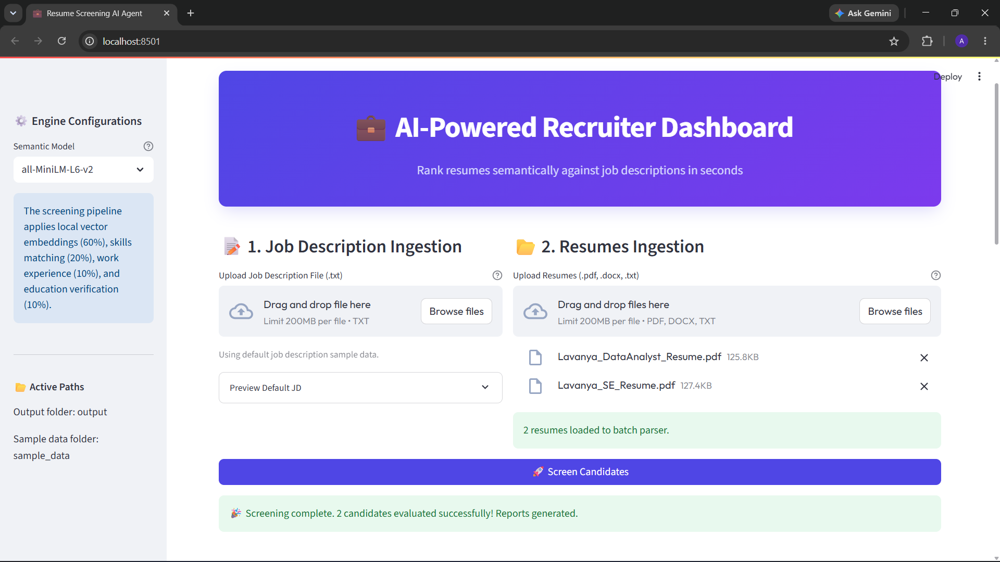

# Resume Screening AI Agent

An AI-powered Resume Screening Agent that automatically ranks candidates against a Job Description using semantic similarity, rule-based skill extraction, and weighted scoring.

The project includes:
- **CLI Pipeline**: Command-line interface to batch process resumes.
- **Streamlit Recruiter Dashboard**: Interactive user interface to upload files, run evaluations, and inspect matches.
- **Resume Parsing**: Support for PDF, DOCX, and plain TXT files.
- **Semantic Resume Ranking**: Pre-trained Sentence Transformers model mapping relevance.
- **CSV & JSON Exports**: Automated ranked summaries and detailed profiles.
- **Automated Tests**: Comprehensive unit tests covering parsing, extraction, and evaluation logic.

---

## Quick Start

Get the application up and running locally in minutes:

```bash
# 1. Clone the repository
git clone https://github.com/lavanya2406/resume-screening-ai-agent.git
cd resume-screening-ai-agent

# 2. Install pinned dependencies
pip install -r requirements.txt

# 3. Launch the Streamlit dashboard
streamlit run app.py
```

---

## Features

- **Document parsing**: Ingest PDF, DOCX, and TXT resumes seamlessly.
- **Entity & Info Extraction**: Parse candidate name, contact, education, certifications, and years of experience.
- **Configurable Skills Mapping**: Match programming languages, web stacks, AI, cloud systems, and database frameworks.
- **Semantic Matching**: Use Sentence Transformers to evaluate candidate profiles against the job description.
- **Scoring Reasoning**: Automatically compile bullet highlights explaining candidate ranking factors.
- **Interactive UI Dashboard**: Compare profiles in a sortable leaderboard, review pool metrics, and inspect breakdowns.
- **Leaderboard Exports**: Instantly download screening reports as `ranking.csv` and `ranking.json`.
- **Unit Tested**: Secure backend logic with automated checks.

---

## AI Technologies Used

- **Sentence Transformers** for dense text representations.
- **all-MiniLM-L6-v2** pre-trained transformer model.
- **Cosine Similarity** mapping semantic vector alignment.
- **Rule-based NLP** using Python regular expressions for custom pattern classification.
- **Semantic Search** mapping resumes to job description contexts.

---

## Evaluation Formula

Candidates are scored out of 100 based on a weighted scoring model matching recruitment priorities:

$$\text{Final Score (0–100)} = 0.60 \times \text{Semantic similarity} + 0.20 \times \text{Skills match} + 0.10 \times \text{Experience} + 0.10 \times \text{Education}$$

- **Semantic Similarity (60% weight)**: Cosine similarity score between full resume and job description.
- **Skills Match (20% weight)**: Keyword overlap ratio between candidate skills and job requirements.
- **Experience Match (10% weight)**: Candidate years compared to minimum required years.
- **Education Match (10% weight)**: Highest degree compared to job description guidelines.

---

## Screenshots

### Dashboard


### Screening Results


### Candidate Inspector


---

## Folder Organization

```text
resume-screening-ai-agent/
│
├── main.py                 # Core CLI orchestrator and execution entrypoint
├── app.py                  # Streamlit recruiter UI dashboard
├── config.py               # Settings loader and directory validator
├── requirements.txt        # Pinned third-party dependency definitions
├── README.md               # Extensive project documentation
├── .env.example            # Environment configuration template
│
├── parser.py               # File reader supporting PDF, DOCX, and TXT parsing
├── extractor.py            # Rule-based regex and keyword information extractor
├── similarity.py           # Cosine similarity based on sentence-transformers
├── scorer.py               # Weighted composite score and reasoning evaluator
├── utils.py                # Logging setup, file readers, and export helpers
│
├── sample_data/            # Target inputs for screening evaluations
│   ├── job_description.txt # Target Job Description parameters
│   └── resumes/            # Input folder to place candidate resumes
│
├── output/                 # Destination folder for generated leaderboard reports
│   ├── ranking.csv         # Structured summary CSV of candidate scores
│   └── ranking.json        # Detailed evaluation breakdown JSON dataset
│
├── screenshots/            # Dashboard preview captures for repository view
│
└── tests/                  # Automated unit test suite
    ├── test_parser.py      # Tests for parser and cleaning operations
    ├── test_extractor.py   # Tests for regex and skill keyword matchers
    ├── test_similarity.py  # Tests for Jaccard and overlap scoring
    └── test_scorer.py      # Tests for experience, education, and composite scores
```

---

## Installation & Setup

### Prerequisites
- Python 3.11 or higher
- Pip package manager

### Detailed Steps

1. **Activate Virtual Environment**:
   ```bash
   # On Windows:
   python -m venv venv
   venv\Scripts\activate

   # On macOS/Linux:
   python3 -m venv venv
   source venv/bin/activate
   ```

2. **Install Pinned Packages**:
   ```bash
   pip install -r requirements.txt
   ```

3. **Configure Environment Variables**:
   - Copy the `.env.example` file to `.env`:
     ```bash
     cp .env.example .env
     ```
   - Update the newly created `.env` file with configuration variables (if needed). The default values will run the sentence-transformers pipeline locally out-of-the-box.

---

## Running Instructions

Ensure you have placed a valid job description text file at `sample_data/job_description.txt` and candidate resumes inside the `sample_data/resumes/` folder.

### Run Screening Agent (CLI)
From the root of the project folder:
```bash
python main.py
```

### Run Recruiter Dashboard (Streamlit Frontend UI)
From the root of the project folder:
```bash
streamlit run app.py
```

### Run Unit Tests
To execute the automated unit test suite:
```bash
python -m unittest discover tests
```

---

## Model Downloading & Caching

> [!NOTE]
> - **First Execution**: The SentenceTransformer model `all-MiniLM-L6-v2` (approx. 90MB) will download automatically from the Hugging Face Hub during the first run.
> - **Subsequent Executions**: The model weights will be loaded directly from the local Hugging Face cache directory on your system. No active internet connection is required for subsequent runs.

---

## Sample Outputs & Previews

### 1. Terminal Table Output
Below is an example of the formatted ASCII ranking table printed to the terminal:
```text
+--------+----------------------+----------+--------------+---------------------------------------------------------+
| Rank   | Candidate            | Score    | Similarity   | Reason / Highlights                                     |
+--------+----------------------+----------+--------------+---------------------------------------------------------+
| 1      | Charlie Smith        | 71.81%   | 75.74%       | Strong Python match, Has NLP experience, Excellent t... |
| 2      | Ivy Taylor           | 70.80%   | 77.08%       | Strong Python match, Has NLP experience, Missing AWS... |
| 3      | Alice Johnson        | 65.02%   | 67.45%       | Strong Python match, Has NLP experience, Good techni... |
| 4      | Grace Lee            | 60.22%   | 65.51%       | Strong Python match, Has NLP experience, Missing AWS... |
| 5      | Henry Wright         | 55.83%   | 69.57%       | Strong Python match, Possesses some requested techni... |
| 6      | Bob Miller           | 46.44%   | 56.94%       | Strong Python match, Missing AWS, Possesses some req... |
| 7      | Eva Green            | 39.32%   | 51.13%       | Strong Python match, Missing AWS, Possesses some req... |
| 8      | Frank White          | 38.65%   | 50.03%       | Missing AWS, Possesses some requested technical skil... |
| 9      | David Davis          | 37.41%   | 47.96%       | Strong Python match, Missing AWS, Possesses some req... |
| 10     | Jack Brown           | 25.19%   | 33.65%       | Missing AWS, Technical skills overlap is low, Educat... |
+--------+----------------------+----------+--------------+---------------------------------------------------------+
```

### 2. Exported CSV Dataset (`output/ranking.csv`)
Below is a preview of the generated comma-separated rankings data:
```csv
Rank,Candidate,Score,Similarity,Reason
1,Charlie Smith,71.81%,75.74%,Strong Python match; Has NLP experience; Excellent technical skills matching job requirements; Meets minimum experience requirement (5.0 years); Good education background matching job requirement; High semantic similarity matching job profile
2,Ivy Taylor,70.80%,77.08%,Strong Python match; Has NLP experience; Missing AWS; Good technical skills matching job requirements; Meets minimum experience requirement (2.0 years); Good education background matching job requirement; High semantic similarity matching job profile
...
```

### 3. Exported JSON Dataset (`output/ranking.json`)
Below is a structured representation of the top evaluation item in the JSON report:
```json
[
    {
        "candidate_name": "Charlie Smith",
        "email": "charlie.smith@example.com",
        "final_score": 71.81,
        "breakdown": {
            "semantic_match": 75.74,
            "skills_match": 81.82,
            "experience_match": 100.0,
            "education_match": 100.0
        },
        "reasoning": [
            "Strong Python match",
            "Has NLP experience",
            "Excellent technical skills matching job requirements",
            "Meets minimum experience requirement (5.0 years)",
            "Good education background matching job requirement",
            "High semantic similarity matching job profile"
        ]
    }
]
```

---

## Limitations

1. **Rule-Based Extraction Sensitivity**: The skills extraction module matches against a defined list of keywords. It may fail to capture skills written as non-standard synonyms or described implicitly (e.g., "created REST services" rather than "FastAPI").
2. **Model Bias in Semantic Similarity**: Similarity scores depend on the vector representations generated by the `all-MiniLM-L6-v2` transformer model. The model might evaluate certain synonyms or wording styles differently than a human reviewer.
3. **Scanned PDF Constraint**: The document parsers assume the PDFs and DOCX files contain text layers. There is no OCR (Optical Character Recognition) support; scanned document images containing only pixel layouts will return empty strings.
4. **Fixed Scoring Weights**: The composite score currently utilizes fixed weights (60% Semantic, 20% Skills, 10% Experience, 10% Education). Changes to these priorities require modifying code variables rather than runtime settings.

---

## Future Improvements

1. **LLM Hybrid Extraction**: Integrate fallback API calls to Google Gemini for resume blocks that rule-based extractors fail to parse cleanly (e.g. complex table structures).
2. **Dynamic Skill Weighting**: Allow recruiters to specify relative importances for different skill categories (e.g. programming skills weighted higher than database skills).
3. **Advanced PDF Extraction**: Incorporate OCR utilities (like `pytesseract`) to parse scanned document images that do not contain native text layer segments.
